#Git Basics

##What is Git?
Git is a widely used version control system for software development. It is a **distributed version control system (DVCS)** with an emphasis on speed, data integrity, and support for distributed, non-linear workflows.

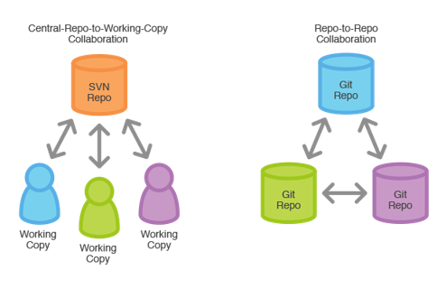

In a DVCS clients don’t just check out the latest snapshot of the files: they fully mirror the repository. Thus if any server dies, and these systems were collaborating via it, any of the client repositories can be copied back up to the server to restore it. Every clone is really a full backup of all the data.

##Creating and cloning repository
If you want to create local repository, create a new directory, open it and perform in console following command:

	$ git init

If you want to create a working copy of existing local repository, run the command: 
	
	$ git clone /path/to/repository

When using a remote server, command will be like:

	$ git clone username@host:/path/to/repository

 
##Typical workflow 

Local repository consists of three "trees" maintained by git. The first one is **Working Directory** which holds the actual files. The second one is the `Index` which acts as **staging area** and finally the `HEAD` which points to the last commit you've made in your **local git repository**.

The typical workflow goes like this: - you create/edit/modify a file inside your repository - you **stage** the changes to the staging area - you **commit** these changes which creates a permanent snapshot of the file in the Git directory along with a message that indicates what you did to the file.

##Recording Changes to the Repository
###Commands: `status`, `add`,  `commit`
 
The main tool you use to determine which files are in which state is the `git status` command. If you run this command directly after a clone, you should see something like this:

	$ git status
	On branch master
	nothing to commit, working directory clean

This means you have a clean working directory – in other words, there are no tracked and modified files. 

Let’s say you add a new file to your project, a simple README file. If the file didn’t exist before, and you run `git status`, you see your untracked file like so:

	$ git status
	On branch master
	Untracked files:
	  (use "git add <file>" to include in what will be committed)
	
	    README
	
	nothing added to commit but untracked files present (use "git add" to track)

You can see that your new README file is untracked. Untracked basically means that Git sees a file you didn’t have in the previous snapshot (commit). 

In order to begin tracking a new file, you use the command git add. To begin tracking the README file, you can run this:

	$ git add README

Running status command again, you can see that your README file is now tracked and staged to be committed:

	$ git status
	On branch master
	Changes to be committed:
	  (use "git rm HEAD --cached <file>..." to unstage)
	
	    new file:   README

Now that your staging area is set up the way you want it, you can commit your changes. The simplest way to commit your changes is following:

	$ git commit -m "Added README file"

Message after flag `-m` is mandatory and it has to be meaningful regarding on commit.  

**Skipping the Staging Area**

Adding the `-a` option to the `git commit` command makes Git automatically stage every file that is already tracked before doing the commit, letting you skip the `git add` part.
If you update your README file, you can stage and commit changes with following command:

	$ git commit -am "Updated README file"

Let's add one more file **web.config**

	$ git add web.config
	$ git commit -am "Added web.config file"

##Viewing the Commit History

After you have created several commits, or if you have cloned a repository with an existing commit history, you’ll probably want to look back to see what has happened. The most basic and powerful tool to do this is the `git log` command.

	$ git log

	commit f30ab3bcb608e1e8451d4b2432f8ecbe6306e7e7
	Author: mikr <milan.krunic@zuehlke.com>
	Date:   The Oct 15 14:15:30 2015 +0200
	
	    Added web.config file

	commit 98ca96dff817ec66f44342007202690a93763949
	Author: mikr <milan.krunic@zuehlke.com>
	Date:   The Oct 15 14:15:29 2015 +0200

    	Updated README file

	commit 34ac23bcb608e1e8451d4b2432f8ecbe6306e7e7
	Author: mikr <milan.krunic@zuehlke.com>
	Date:   The Oct 15 14:15:25 2015 +0200
	
	    Added README file

##Git Branching and Merging
- *Branching, in revision control and software configuration management, is the duplication of an object under revision control (such as a source code file, or a directory tree) so that modifications can happen in parallel along both branches* - Wikipedia

- Branching means you diverge from the main line of development and continue to do work without messing with that main line.

The default branch name in Git is master. As you start making commits, you’re given a master branch that points to the last commit you made. Every time you commit, it moves forward automatically. *The “master” branch in Git is not a special branch. It is exactly like any other branch. The only reason nearly every repository has one is that the `git init` command creates it by default and most people don’t bother to change it.*

###Creating new branch

What happens if you create a new branch? Well, doing so creates a new pointer for you to move around. Let’s say you create a new branch called **testing**. You do this with the `git branch` command: 
	
	$ git branch testing

This creates a new pointer at the same commit you’re currently on.

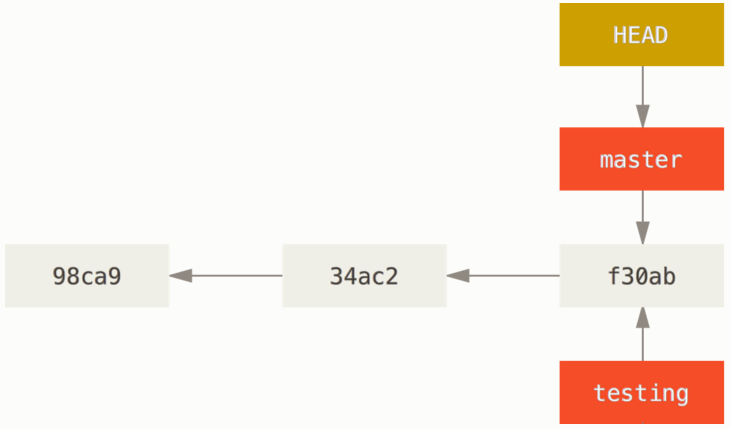

How does Git know what branch you’re currently on? It keeps a special pointer called `HEAD`. Note that this is a lot different than the concept of `HEAD` in other VCSs you may be used to, such as Subversion or CVS. In Git, this is a pointer to the local branch you’re currently on. In this case, you’re still on `master`.
 
**The `git branch` command only created a new branch – it didn’t switch to that branch.**

If you want to create a new branch and immediately switch to it you can accomplish that with following command:

	$ git checkout -b "NameOfBranch"

Otherwise you need to switch manually like it is shown is example bellow.

###Switching branches

To switch to an existing branch, you run the `git checkout` command. Let’s switch to the new **testing** branch:

	$ git checkout testing

This moves `HEAD` to point to the **testing** branch.

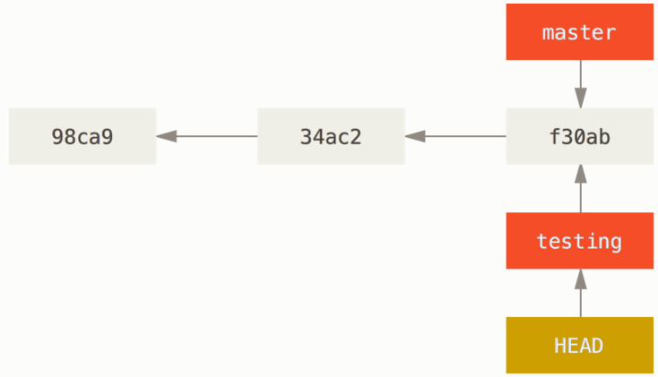

What is the significance of that? Well, let’s update our **web.config** file and do another commit:

	$ git commit -am "Updated web.config file"

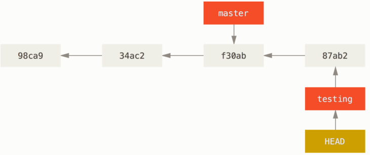

This is interesting, because now your **testing** branch has moved forward, but your **master** branch still points to the commit you were on when you ran `git checkout` to switch branches. Let’s switch back to the **master** branch:

	$ git checkout master

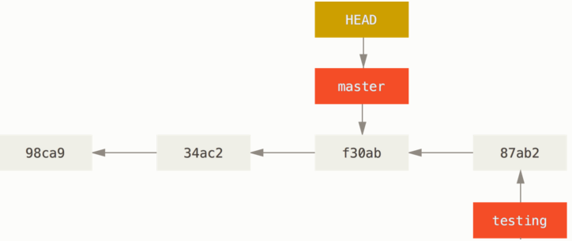

That command did two things. It moved the `HEAD` pointer back to point to the `master` branch, and it reverted the files in your working directory back to the snapshot that `master` points to. This also means the changes you make from this point forward will diverge from an older version of the project. It essentially rewinds the work you’ve done in your **testing** branch so you can go in a different direction.

It’s important to note that when you switch branches in Git, files in your working directory will change. If you switch to an older branch, your working directory will be reverted to look like it did the last time you committed on that branch. If Git cannot do it cleanly, it will not let you switch at all.

###Git Merging

To understand better what the merging is and what it is used for, let's go through a simple example of branching and merging with a workflow that you might use in the real world. You’ll follow these steps:

1. Do work on a web site.
2. Create a branch for a new story you’re working on.
3. Do some work in that branch.

At this stage, you’ll receive a call that another issue is critical and you need a hotfix. You’ll do the following:

1. Switch to your production branch.
2. Create a branch to add the hotfix.
3. After it’s tested, merge the hotfix branch, and push to production.
4. Switch back to your original story and continue working. 

First, let’s say you’re working on your project and have a couple of commits already.

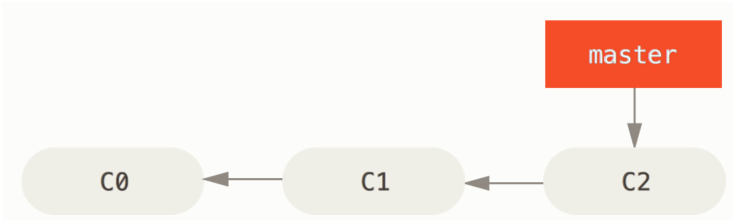

You’ve decided that you’re going to work on **issue #53** in whatever issue-tracking system your company uses. To create a branch and switch to it at the same time, you can run the git checkout command with the -b switch:

	$ git checkout -b iss53
	
This is shorthand for:

	$ git branch iss53
	$ git checkout iss53

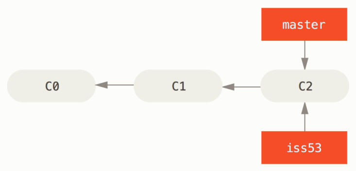

You work on your web site and do some commits. Doing so moves the **iss53** branch forward, because you have it checked out (that is, your `HEAD` is pointing to it):

	$ git commit -a -m "Added a new footer [issue 53]"

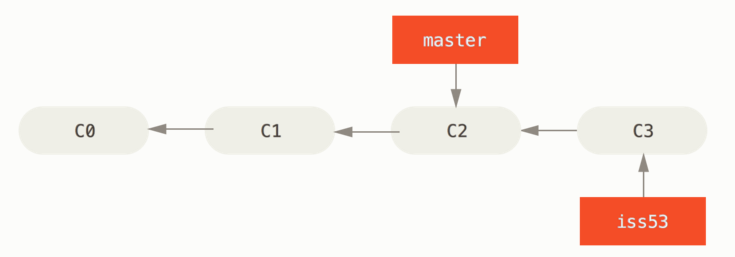

Now you get the call that there is an issue with the web site, and you need to fix it immediately. With Git, you don’t have to deploy your fix along with the **iss53** changes you’ve made, and you don’t have to put a lot of effort into reverting those changes before you can work on applying your fix to what is in production. All you have to do is switch back to your `master` branch.

However, before you do that, note that if your working directory or staging area has uncommitted changes that conflict with the branch you’re checking out, Git won’t let you switch branches. It’s best to have a clean working state when you switch branches. So, let’s assume you’ve committed all your changes, so you can switch back to your `master` branch:

	$ git checkout master

At this point, your project working directory is exactly the way it was before you started working on issue #53, and you can concentrate on your hotfix. This is an important point to remember: when you switch branches, Git resets your working directory to look like it did the last time you committed on that branch. It adds, removes, and modifies files automatically to make sure your working copy is what the branch looked like on your last commit to it.

Next, you have a hotfix to make. Let’s create a hotfix branch on which to work until it’s completed:

	$ git checkout -b hotfix

After we finished our work we can commit changes.

	$ git commit -am "Fixed the broken email address"

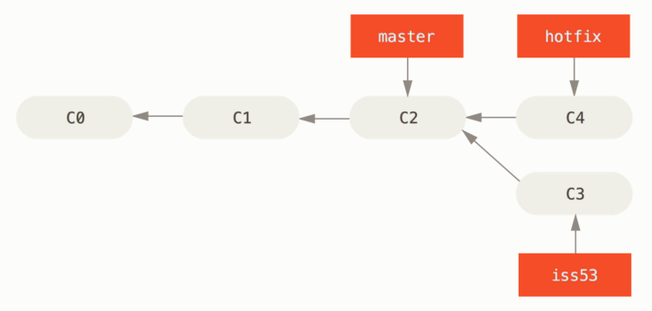

You can run your tests, make sure the hotfix is what you want, and **merge it back into your `master` branch** to deploy to production. You do this with the `git merge` command:

	$ git checkout master
	$ git merge hotfix

Your change is now in the snapshot of the commit pointed to by the `master` branch, and you can deploy the fix.

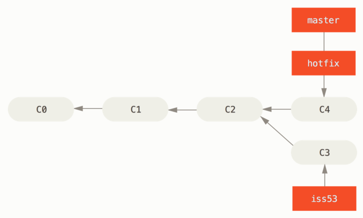

After your super-important fix is deployed, you’re ready to switch back to the work you were doing before you were interrupted. However, first you’ll delete the `hotfix` branch, because you no longer need it – the `master` branch points at the same place. You can delete it with the `-d` option to `git branch`:

	$ git branch -d hotfix

Now you can switch back to your work-in-progress branch on issue #53 and continue working on it.

	$ git checkout iss53

Let's assume that we finished work on `iss53` branch and we want commit changes.

	$ git commit -a -m "Finished the new footer [issue 53]"

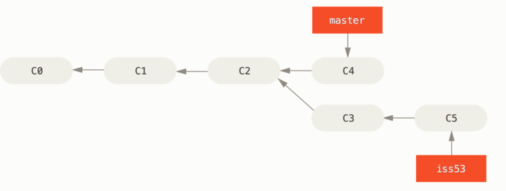

Suppose you’ve decided that your issue #53 work is complete and ready to be merged into your `maste`r branch. In order to do that, you’ll merge your `iss53` branch into `master`, much like you merged your `hotfix` branch earlier. All you have to do is check out the branch you wish to merge into and then run the `git merge` command:

	$ git checkout master
	$ git merge iss53

Git creates a new snapshot that results from this three-way merge and automatically creates a new commit that points to it. This is referred to as a merge commit, and is special in that it has more than one parent.

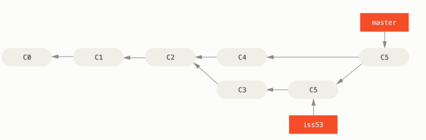

Now that your work is merged in, you have no further need for the `iss53` branch. You can close the ticket in your ticket-tracking system, and delete the branch:

	$ git branch -d iss53

###Basic Merge Conflicts

Occasionally, this process doesn’t go smoothly. If you changed the same part of the same file differently in the two branches you’re merging together, Git won’t be able to merge them cleanly. If your fix for issue #53 modified the same part of a file as the `hotfix`, you’ll get a merge conflict that looks something like this:

	$ git merge iss53
	Auto-merging web.config
	CONFLICT (content): Merge conflict in web.config
	Automatic merge failed; fix conflicts and then commit the result.

Git hasn’t automatically created a new merge commit. It has paused the process while you resolve the conflict. If you want to see which files are unmerged at any point after a merge conflict, you can run `git status`:

	$ git status
	On branch master
	You have unmerged paths.
	  (fix conflicts and run "git commit")
	
	Unmerged paths:
	  (use "git add <file>" to mark resolution)
	
	    both modified:      web.config
	
	no changes added to commit (use "git add" and/or "git commit -a")

Anything that has merge conflicts and hasn’t been resolved is listed as unmerged. Git adds standard conflict-resolution markers to the files that have conflicts, so you can open them manually and resolve those conflicts.

To use a graphical tool to resolve these issues, you can run git mergetool, which fires up an appropriate visual merge tool and walks you through the conflicts:

	$ git mergetool
	
	This message is displayed because 'merge.tool' is not configured.
	See 'git mergetool --tool-help' or 'git help config' for more details.
	'git mergetool' will now attempt to use one of the following tools:
	opendiff kdiff3 tkdiff xxdiff meld tortoisemerge gvimdiff diffuse diffmerge ecmerge p4merge araxis bc3 codecompare vimdiff emerge
	Merging:
	web.config
	
	Normal merge conflict for 'web.config':
	  {local}: modified file
	  {remote}: modified file
	Hit return to start merge resolution tool (opendiff):

After you hit Enter button, visual merge tool will show and it looks like this:

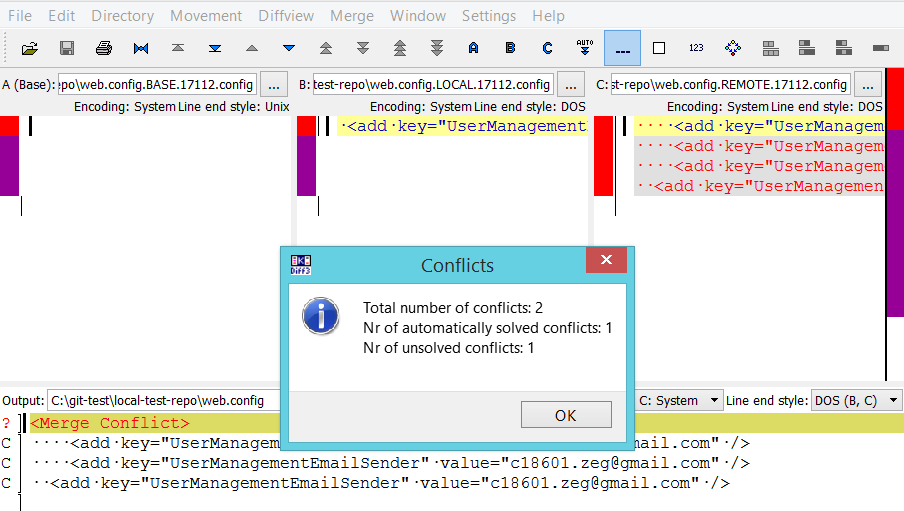

It says we have 1 unsolved conflict, which is actually conflict at the first line in web.config file.

Merge tool has following windows:

1. **A (Base)** - showing base state of conflicted file, which is common state for both branches 
2. **B** - state of conflicted file at current branch (master)
3. **C** - state of conflicted file at (remote) branch that we want to merge into master (current) branch
4. **Output** - Result file after resolving conflict

In this case, let's say we want result file which contains all changes from current  branch(**Window B**) and from the remote branch (**Window C**) as well. To do this we have to choose buttons **B** and **C** from tool bar.

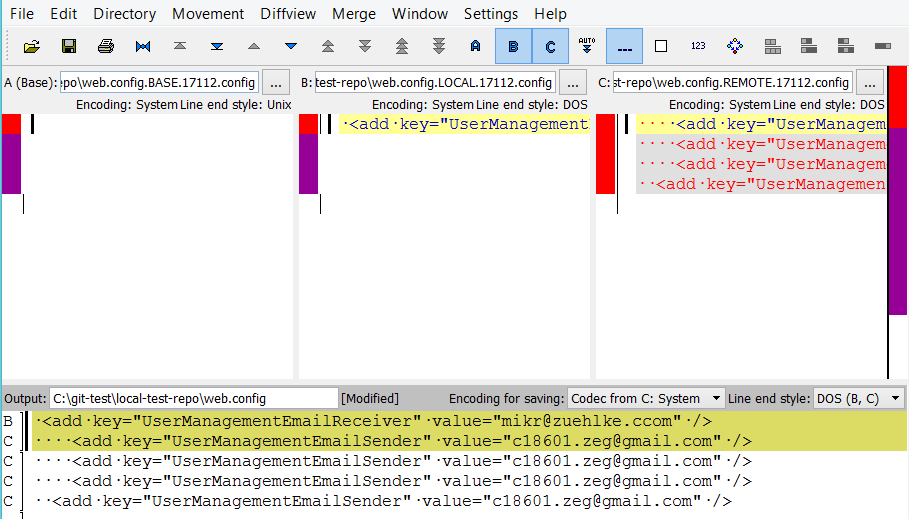

After clicking on **B** and **C** output window shown immediately how result file will look like. After we solve conflict we need to save result file (Ctrl + S), commit changes that we just made on web.config file and execute merge command again.

##Working with Remotes

To be able to collaborate on any Git project, you need to know how to manage your remote repositories. Remote repositories are versions of your project that are hosted on the Internet or network somewhere. Collaborating with others involves managing these remote repositories and pushing and pulling data to and from them when you need to share work.

To see which remote servers you have configured, you can run the `git remote` command.

If you’ve cloned your repository, you should at least see **origin** – that is the default name Git gives to the server you cloned from.

	$ git remote
	origin

To add a new remote Git repository as a shortname you can reference easily, run `git remote add [shortname] [url]`

	$ git remote add gitintro https://github.com/milankr/zrs-curriculum-test.git
Now you can use the string **gitintro** on the command line in lieu of the whole URL.

###Fetching and Pulling from Remotes
To get data from your remote projects, you can run:
	
	$ git fetch [remote-name] 
 
It’s important to note that the git fetch command pulls the data to your local repository – it doesn’t automatically merge it with any of your work or modify what you’re currently working on. You have to merge it manually into your work when you’re ready.

Using `git pull` command you automatically **fetch** and then **merge** a remote branch into your current branch.

###Pushing to Remotes

When you have your project at a point that you want to share, you have to push it upstream. The command for this is simple: 

	git push [remote-name] [branch-name]

If you want to push your master branch to your origin server (again, cloning generally sets up both of those names for you automatically), then you can run this to push any commits you’ve done back up to the server:
	
	$ git push origin master