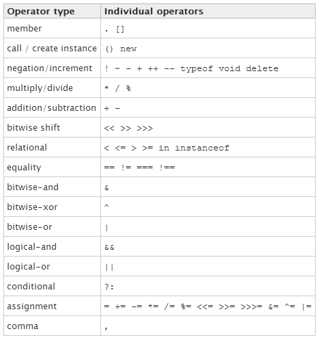

# JavaScript Basics

## What is JavaScript (EcmaScript)?

JavaScript is **the** programming (script) language of HTML and the Web.

Characteristics:

- Dynamic (types of variables can be changed)​
- Imperative​
- Object-oriented
- Prototype based: 
	- Objects are created by cloning existing objects and extending them​
- Functional​
    - Everything is a function (even objects)​
    - Function is a “base type” (like `object` in C# & JAVA)​​
- Runs in a web browser script engine

### Including JS file in HTML

- Use the `
		</body>
	</html>

### Declaring a variable
Variables are declared using the `var` keyword.

	var a = 5;​
	var text = "Some message"​;

> **Never declare a variable without the `var` keyword!​**   
> It will automatically become a global variable, and can cause problems.

> **Try to always initialize variables when declaring them.​**   
> This will: make code cleaner & avoid undefined variables.

> **Never declare number, string, or boolean as Objects**
> Always declare numbers, strings, or booleans as primitive values and not as objects.  
> Declaring these types as objects slows down execution speed, and you can't compare primitives to objects.  
> Good: `var x = "John";`   
> Bad: `var y = new String("John");`  
> `"John" === new String("John"); // This is false` 

## Data types
- Primitives:​
	- Boolean​
	- Number (float)​
	- String​
	- Null (object is null)​
	- Undefined (variable doesn’t exist, it was never declared)
- Array​
- Function​
- Object

### Arrays
Characteristics of arrays in JavaScript:

- Zero-based index
- Can hold different type in same array
- Multi-dimensional arrays can be *jagged*, i.e. have different lengths

Example:

    var arr1 = ["one", "two", "three"]; // defining an array with 3 elements

	var arr2 = []; // declaring an empty array
	arr2.push("one"); // adding element to the end of array
	
	// Avoid declaration with the new keyword, it is not conventional
	var arr3 = new Array(1, 2, 3); 

> **Try to avoid arrays with multiple types and jagged arrays**.   
> They bring complexity to code and are rarely useful.  
> Avoid multiple types: `["b", 4, true]`.   
> Avoid jagged arrays: `[[1, 2], [1, 2, 3, 4], [1]]`

### Equality
##### Strict `===` vs Loose `==`   

JavaScript has 2 types of equality operators:

-  **`===` strict equality** which performs an exact comparison by type and value
- **`==` loose equality** which tries to perform a conversion to the corresponding value of the compared type, and then compares

Examples:

	if (4 == "4") { // converts string to number, so it will be true
		// wil execute
	}

	if (4 === "4") { // false
		// will not execute
	}

	if (4 != "4") { // false
		// will not execute
	}

	if (4 !== "4") { // true
		// will execute
	}

> **Always try to use triple equals `===` !**   
> This avoids unexpected logic errors and performs better.

### Conversion
Explicit conversion is done with corresponding functions.

	var value = Number("4")​;

	if (value === 4) {
		// will execute 
	}​
​
Implicit conversion is done automatically, whenever possible.

	var value = 3;​
	var text = "Rings for the Elven-kings under the sky: " + value;​
​
> **Careful: Use brackets during concatenation if needed**:   

    var result = “Sum: ” + 4 + 6;  // results in “Sum: 46”​

	var result “Sum: “ + (4 + 6) // results in “Sum: 10”

### Truthy & falsy​
- All values are truthy unless they are defined as [falsy](https://developer.mozilla.org/en-US/docs/Glossary/Falsy "falsy").
- A value is falsy if it evaluates to `false` when converted to boolean.​

​
Falsy values:

- `false`​
- `0` & `-0`​
- `""` & `''`​ (empty string)
- `null` 
- `undefined`​
- `NaN` (result of unsuccessful explicit conversion to number)

**Falsy values are most often used to check if a value is `null` or `undefined` ("null guard")**

	var value = null;

	if (!value) { // 'value' is falsy
		return; // will execute
	}

## Operators
The table of [operator](https://developer.mozilla.org/en-US/docs/Web/JavaScript/Guide/Expressions_and_Operators) precedence.

​

### Member operator `[]`
Used to access array members (zero-based).

	var arr = ["one", "two", "three"];
	var item = arr[1]; // Gets the second element

Also used for objects as an alternative way to access properties.

	// 2 ways to access object property value
	var propertyValue = obj.someProperty;
	var propertyValue = obj["someProperty"];

### `typeof` operator
Determines a variable's type.
Result is a string.

	var variableType = typeof 37;

	if (variableType === "number") {
		// will execute
	}

List of types with result from the `typeof` operator:
 
	Type					Result
	
	Undefined				"undefined"
	Null					"object"
	Boolean					"boolean"
	Number					"number"
	String					"string"
	Function object 		"function"
	Any other object		"object"

### `instanceof` operator

Check if an object is a descendant of another object.

	if (someObject instanceof ancestorObject)​ {
		// will execute if someObject inherits ancestorObject
	}

Example:

	var myDate = new Date();​
	if (myDate instanceof Date) {​
		// will execute​
	}

## Flow control & loops
JavaScript has all the usual flow control & loop concepts:

### Flow control

	// if...else

    if (value === 4) {
		// executes if value equals 4
	} else if (value > 10) {
		// executes if value is greater than 10
	} else {
		// executes in all other cases
	}

	
	// switch 
	
	switch (actionValue) {
		case "do":
			// executes if actionValue equals "do"
			break;
		case "do not":
			// executes if actionValue equals "do not"
			break;
		default:
			// executes in all other cases, e.g. when actionValue equals "try"
			break;		
	}

	// Conditional (ternary) (?:) operator
		 
	return droids === "looking for"  ? "shoot them" : "move along";
	// returns "shoot them" if droids equals "looking for"; otherwise returns "move along"

### Loops

	// for
	
	for (var i = 0; i < 10; i++) {
		// executes this block 10 times
	}

	// while

	while (input !== "x") {
		// executes while input doesn't equal "x" 
	}

### `for` vs `forEach()` vs `for`...`in`
	var array = ["one", "hundered", "three"]; 

	// Example: There are 2 ways to concatenate the texts in array

	// with for
	for (i = 0; i < array.length; i++) { ​
	    text += array[i];​
	}​
	
	// with forEach function, where "item" is the current item of the loop
	array.forEach(function (item, index, originalArray) {​
	    text += item;​
	});​
	​
		​
	// for…in iterates through properties of an object​
	// it should not be used for iterating through an arrray 
	​
	for (prop in object) {​
	    console.log(prop); // outputs property name​
	    console.log(object[prop]); // outputs property value​
	}

### Exception handling
`throw` short circuits the code and “bubbles up” through code until it reaches a `try-catch` block.

	try {​
	    // Block of code to try and execute. Throws an error object.​
		if (!value) {
	    	throw new Error("Value cannot be null.")​;
		}
	}​
	catch(err) {​
	    // Block of code to handle errors. Executes only if block in try throws.
	    console​.log(err.message);
	}​
	finally {​
	    // Block of code to be executed regardless of the try/catch result​		
	}

> **Best practices:**
> 
> - Handle **all** exceptions that may occur and influence user's work-flow    ​
> - Do not use exceptions for non-exceptional flow control​
> - Prefer exceptions to error codes (like `-1`, `false`, `0x3343`…)   ​
> - Create your own exception types, instead of using the default `Error` object

## Scopes of variables
There are 2 types of scopes:
 
- Local scopes
- Global scopes
 
## Local scopes
- Local scope is reachable only inside a function.​
- Local scope hides a global variable if it has the same name.

Example:

	var val = 2;
	​
	function three() {​
	  var val = 3;​
	  alert(val); // outputs 3 always​
	}​
​
> **Careful: New scopes are not created in blocks of if, for, while, switch…​**    
> New scope is created only inside a function.

## Lifetime of scopes
- Local variables are deleted (become `undefined`) when the function is completed.​
- Global variables are deleted when you close the page.​
​
> **Beware of automatically global scopes.**    
> They are defined if `var` keyword is omitted.

	function myFunction() {​
	    carName = "Volvo"; // will be declared globally if no var keyword is used​
	}

## Task
### A Guessing Game

##### Requirements

- User is asked if they know “the answer to everything”​
- They can press ESC, and will get a response:​
	- "You must enter something! Nothing is not an answer!“​
- They can answer with a non number (e.g. string), and will get a hint:​
	- "The answer is a number.“​
- They can miss the number, and will get a hint:​
	- "Your closest guess so far was: [number]“.​
- They can guess a maximum number of 10 times, and if they don’t make it, they get a notification:​
	- "You reached your limit of 10 guesses and cannot guess anymore.“​
- If they guess correctly, they get a response:​
	- "Good guess! 42 is the answer to everything!"
	 

Complete the task by ​​modyfing code marked with `// TODO: ` comments.   
> ***Always* ask for help if you get stuck for too long!**