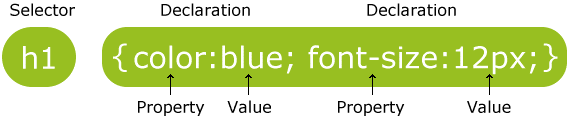
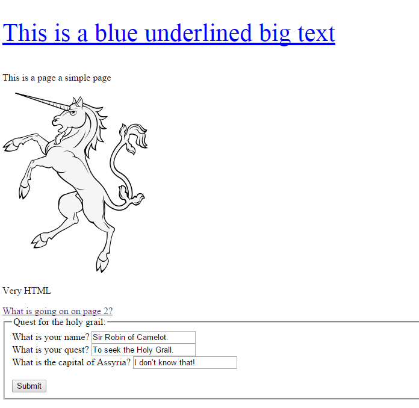
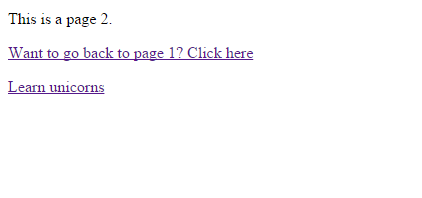

## HTML & CSS basics ##

### Overview ###

- HTML tags
- CSS
- Forms
		
### HTML Tags ###
		
The head element (that which starts with the <head> opening tag and ends with the </head> closing tag) appears before the body element (starting with <body> and ending with </body>) and contains information about the page. The information in the head element does not appear in the browser window.

“My first web page” will appear on a tab or the title bar of the window (not the actual canvas area). 

	<!DOCTYPE html>
	<html>
		<head>
			<title>My first web page</title>
		</head>
		<body> 
			This is my first web page
		</body>
	</html> 

The p tag is used for paragraphs.
The two lines will now appear on two lines because the browser recognizes them as separate paragraphs.

	
This is my first web page
 
	
this is a second line
 

You can emphasize text in a paragraph using em (emphasis) and strong (strong importance).

	
This text is <em>italic</em> and this is <strong> bold </strong> text
 

Traditionally, browsers will display em in italics and strong in bold by default.

The line-break tag can be used to separate lines like this:

	This is my first web page  And this another line

There’s no content involved in breaking lines so there is no closing tag.

Headings are defined with the `<h1>` to `<h6>` tags.

- `<h1>` defines the most important (largest) heading. 
- `<h6>` defines the least important (smallest) heading.

Example:

	<h1>This is a heading</h1>
	<h2>This is a heading</h2>
	<h3>This is a heading</h3>

Unordered lists and ordered lists work the same way, except that the former is used for non-sequential lists with list items usually preceded by bullets and the latter is for sequential lists, which are normally represented by incremental numbers.

The `<ul>` tag is used to define unordered lists and the `<ol>` tag is used to define ordered lists. Inside the lists, the li tag is used to define each list item.
Example:

	<ul>
		<li>What is your name</li>
		<li>What is your quest</li> 
		<li>What is the capital of Asyria</li>
	</ul>
	
	<ol>
		<li>What is your name</li>
		<li>What is your quest</li> 
		<li>What is the capital of Asyria</li>
	</ol>

The `` tag is used to put an image in an HTML document and it looks like this:

	

An anchor tag `` is used to define a link.

	<a href="http://www.htmldog.com">HTML Dog</a>

- The `<table>` element defines the table.
- The `<tr>` element defines a table row.
- The `<td>` element defines a data cell. These must be enclosed in `<tr>` tags.

		<table> 
			<tr>
				<td>Row 1, cell 1</td>
				<td>Row 1, cell 2</td> 
				<td>Row 1, cell 3</td>
			</tr>
			<tr>
				<td>Row 2, cell 1</td>
				<td>Row 2, cell 2</td> 
				<td>Row 2, cell 3</td>
			</tr>
		</table>

### Forms ###

- HTML forms are used to collect user input.
- The `<input>` element is the most important form element.
- The `<input>` element has many variations, depending on the type attribute.

		<form>  
			First name:     
				<input type="text" name="firstname">   
			Last name: 
				<input type="text" name="lastname">
		</form>

Examples of input types:

<table> 
	<tr>
		<th> TYPE </th>
		<th>DESCRIPTION</th> 
	</tr>
	<tr>
		<td>text</td>
		<td>Defines normal text input</td> 
	</tr>
	<tr>
		<td>radio</td>
		<td>Defines radio button input (for selecting one of many choices)</td> 
	</tr>
	<tr>
		<td>submit</td>
		<td>Defines a submit button (for submitting the form)</td> 
	</tr>
</table>

The action attribute defines the action to be performed when the form is submitted.
The common way to submit a form to a server, is by using a submit button.
Normally, the form is submitted to a web page on a web server.

	<form action="action_page.php">

The method attribute specifies the HTTP method (GET, POST) to be used when submitting the forms:

	<form action="action_page.php" method="GET">
	
	<form action="action_page.php" method="POST">

You can use GET (the default method):

- If the form submission is passive (like a search engine query), and without sensitive information.
- When you use GET, the form data will be visible in the page address:

You should use POST:

- If the form is updating data, or includes sensitive information (password).
- POST offers better security because the submitted data is not visible in the page address.

To be submitted correctly, each input field must have a name attribute.
This example will only submit the "Last name" input field:

	<form action="action_page.php">
	  First name:  
			<input type="text" value=“King">
	  
	  Last name:   <input type="text" name="lastname" value=“Arthur"> 
	  <input type="submit" value="Submit">
	</form>

List of form attributes:

<table>
	<thead>
		<tr>
		  <th>Attribute</th>
		  <th>Description</th>
		</tr>
	</thead>
	<tbody>
		<tr>
		  <td>accept-charset</td>
		  <td>Specifies the charset used in the submitted form (default: the page charset).</td>
		</tr>
		<tr>
		  <td>action</td>
		  <td>Specifies an address (url) where to submit the form (default: the submitting page).</td>
		</tr>
		<tr>
		  <td>autocomplete</td>
		  <td>Specifies if the browser should autocomplete the form (default: on).</td>
		</tr>
		<tr>
		  <td>enctype</td>
		  <td>Specifies the encoding of the submitted data (default: is url-encoded).</td>
		</tr>
		<tr>
		  <td>method</td>
		  <td>Specifies the HTTP method used when submitting the form (default: GET).</td>
		</tr>
		<tr>
		  <td>name</td>
		  <td>Specifies a name used to identify the form (for DOM usage: document.forms.name).</td>
		</tr>
		<tr>
		  <td>novalidate</td>
		  <td>Specifies that the browser should not validate the form.</td>
		</tr>
		<tr>
		  <td>target</td>
		  <td>Specifies the target of the address in the action attribute (default: _self).</td>
		</tr>
	</tbody>
</table>

## CSS ##

What is CSS?

- CSS stands for Cascading Style Sheets
- CSS defines how HTML elements are to be displayed
- Styles were added to HTML 4.0 to solve a problem
- External Style Sheets are stored in CSS files

HTML was NEVER intended to contain tags for formatting a document.
HTML was intended to define the content of a document, like:

`<h1>`This is a heading`</h1>`
`
`This is a paragraph.`
`

When tags like ``, and color attributes were added to the HTML 3.2 specification, it started a nightmare for web developers. Development of large web sites, where fonts and color information were added to every single page, became a long and expensive process.

To solve this problem, the World Wide Web Consortium (W3C) created CSS.

In HTML 4.0, all formatting could (and should!) be removed from the HTML document, and stored in a separate CSS file.

A CSS rule set consists of a **selector** and a **declaration** block.

The **selector** points to the HTML element you want to style.

The **declaration** block contains one or more declarations separated by **semicolons**.

Each declaration includes a property **name** and a **value**, separated by a **colon**.

A CSS declaration always ends with a semicolon, and declaration groups are surrounded by curly braces.
To make the CSS code more readable, you can put one declaration on each line.

In the following example all `
` elements will be center-aligned, with a red text color:

	p {    
		color: red; 
		text-align: center;
	}

There are three ways of inserting a style sheet:

1. External style sheet
2. Internal style sheet
3. Inline style

**External Style Sheet**

With an external style sheet, you can change the look of an entire website by changing just one file!
Each page must include a reference to the external style sheet file inside the `<link>` element. The `<link>` element goes inside the head section:

	<head>      
		<link rel="stylesheet" type="text/css" href="mystyle.css">
	</head>

**Internal Style Sheet**

An internal style sheet may be used if one single page has a unique style.
Internal styles are defined within the `
	</head>

**Inline Styles**

An inline style may be used to apply a unique style for a single element.
An inline style loses many of the advantages of a style sheet (by mixing content with presentation). Use this method sparingly.

To use inline styles, add the style attribute to the relevant tag. The style attribute can contain any CSS property. The example shows how to change the color and the left margin of a `<h1>` element:

	<h1 style="color:blue;margin-left:30px;">This is a heading.</h1>

**CSS Selectors**

CSS selectors allow you to select and manipulate HTML elements.
CSS selectors are used to "find" (or select) HTML elements based on their id, class, type, attribute, and more.

**The element Selector**

The element selector selects elements based on the element name.
You can select all `
` elements on a page like this: (all `
` elements will be center-aligned, with a red text color)

	p {    
		text-align: center;   
		color: red;
	}

**The id Selector**

The id selector uses the id attribute of an HTML element to select a specific element.
An id should be unique within a page, so the id selector is used if you want to select a single, unique element.

To select an element with a specific id, write a hash character, followed by the id of the element.
The style rule below will be applied to the HTML element with `id="para1"`:

	#para1 {    
		text-align: center;    
		color: red;
	}

**The class Selector**

The class selector selects elements with a specific class attribute.
To select elements with a specific class, write a period character, followed by the name of the class:
In the example below, all HTML elements with `class="center"` will be center-aligned:

	.center {    
		text-align: center;    
		color: red;
	}

**Grouping Selectors**

You can group the selectors, to minimize the code.
To group selectors, separate each selector with a comma.

	h1, h2, p {    
		text-align: center;    
		color: red;
	}

## Exercise ##

Create page that looks like picture below, the CSS should be in a separate file, use the appropriate HTML tags.

It should redirect to page2.html, which is in the exercise folder:

