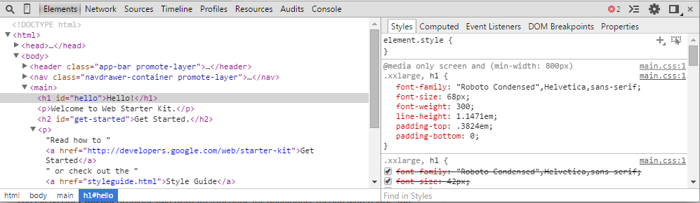
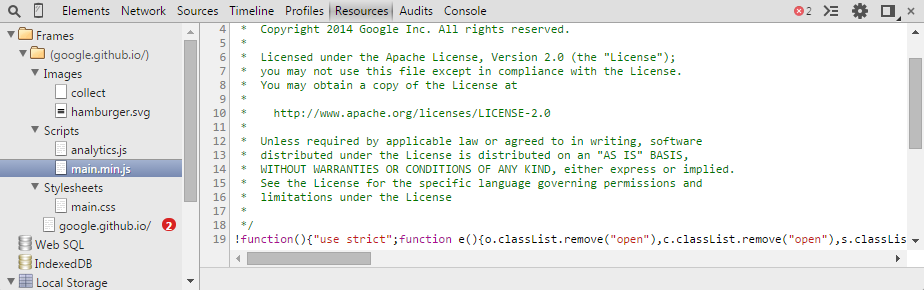

# Debugging in Chrome DevTools

The Chrome Developer Tools (DevTools for short), are a set of web authoring and debugging tools built into Google Chrome. The DevTools provide web developers with the ability to debug javascript code as well as inspect the DOM, css styles, cookies/localstorage, network communication, profile js and rendering performance and more.

Use the DevTools to efficiently track down layout issues, set JavaScript breakpoints, and get insights for code optimization.

## Accessing the DevTools

To access the DevTools, open a web page or web app in Google Chrome. Either:

*   Select the **Chrome menu**  at the top-right of your browser window, then select **Tools** > **Developer Tools**.
*   Right-click on any page element and select **Inspect Element**.

The DevTools window will open at the bottom of your Chrome browser.

There are several useful shortcuts for opening the DevTools:

*   Use <kbd class="kbd">Ctrl</kbd>+<kbd class="kbd">Shift</kbd>+<kbd class="kbd">I</kbd> (or <kbd class="kbd">Cmd</kbd>+<kbd class="kbd">Opt</kbd>+<kbd class="kbd">I</kbd> on Mac) to open the DevTools.
*   Use <kbd class="kbd">Ctrl</kbd>+<kbd class="kbd">Shift</kbd>+<kbd class="kbd">J</kbd> (or <kbd class="kbd">Cmd</kbd>+<kbd class="kbd">Opt</kbd>+<kbd class="kbd">J</kbd> on Mac) to open the DevTools and bring focus to the Console.
*   Use <kbd class="kbd">Ctrl</kbd>+<kbd class="kbd">Shift</kbd>+<kbd class="kbd">C</kbd> (or <kbd class="kbd">Cmd</kbd>+<kbd class="kbd">Shift</kbd>+<kbd class="kbd">C</kbd> on Mac) to open the DevTools in Inspect Element mode, or toggle Inspect Element mode if the DevTools are already open.

## The DevTools window

The DevTools are organised into task-oriented groups in the toolbar at the top of the window. Each toolbar item and corresponding panel let you work with a specific type of page or app information, including <abbr title="Document Object Model">DOM</abbr> elements, resources, and sources.

<figure>

<figcaption>The colorpicker available in the DevTools..</figcaption>

</figure>

Overall, there are eight main groups of tools available view Developer Tools:

*   [Elements](http://developer.chrome.com/devtools/docs/dom-and-styles)
*   [Resources](http://developer.chrome.com/devtools/docs/resource-panel)
*   [Network](http://developer.chrome.com/devtools/docs/network)
*   Sources
*   [Timeline](http://developer.chrome.com/devtools/docs/timeline)
*   [Profiles](http://developer.chrome.com/devtools/docs/profiles)
*   Audits
*   [Console](http://developer.chrome.com/devtools/docs/console)

You can use the <kbd><kbd class="kbd">Ctrl</kbd>+<kbd class="kbd">[</kbd></kbd> and <kbd><kbd class="kbd">Ctrl</kbd>+<kbd class="kbd">]</kbd></kbd> shortcuts to move between panels.

## Working with the Console

The [JavaScript Console](http://developer.chrome.com/devtools/docs/console) provides two primary functions for developers testing web pages and applications. It is a place to:

*   Log diagnostic information in the development process. (output of errors, console.log calls, network requests...)
*   A shell prompt which can be used to evaluate javascript code and get results in an interactive manner

<figure>

<figcaption>Evaluating some commands in the <abbr title="JavaScript">JS</abbr> Console.</figcaption>

</figure>

## Debugging JavaScript

Powerful debugging tools to help quickly discover the cause of an issue in javascript execution and fix it efficiently. 

<figure>

<figcaption>A conditonal breakpoint which logs to the console.</figcaption>

</figure>

## Inspecting the DOM and styles

The **[Elements](http://developer.chrome.com/devtools/docs/dom-and-styles)** panel lets you see everything in one DOM tree, and allows inspection and on-the-fly editing of DOM elements. You will often visit the Elements tabs when you need to identify the <abbr title="HyperText Markup Language">HTML</abbr> snippet for some aspect of the page. For example, you may be curious if an image has an HTML id attribute and what the value is.

<figure>

<figure>Viewing a heading element in the DOM.</figure>

</figure>

## Network requests

The **Network** panel provides insights into resources that are requested and downloaded over the network in real time.

<figure>

<figcaption>The context menu for network requests.</figcaption>

</figure>

## Inspecting storage

The **Resources** panel lets you inspect resources that are loaded in the inspected page. It lets you interact with HTML5 Database, Local Storage, Cookies, AppCache, etc.

<figure>

<figcaption>The JavaScript file of the [Web Starter Kit](https://developers.google.com/web/starter-kit/) as displayed in the resources panel.</figcaption>

</figure>