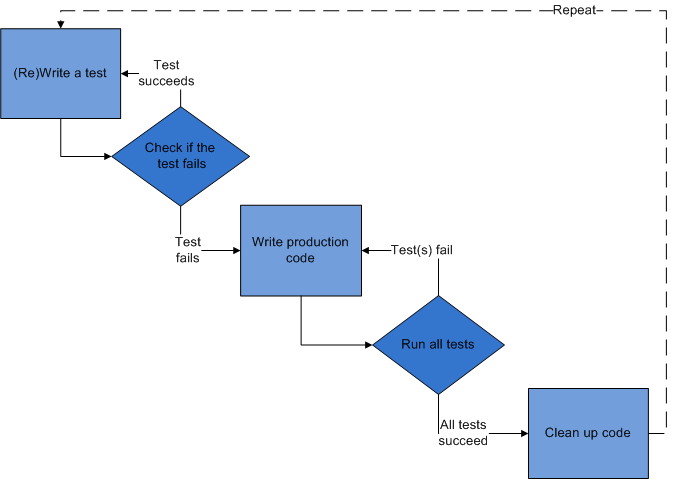

#Test-driven Development (TDD)

##What is TDD?
TDD is a software development process that relies on the repetition of a very short development cycle: first the developer writes an (initially failing) automated test case that defines a desired improvement or new function, then produces the minimum amount of code to pass that test, and finally refactors the new code to acceptable standards.
Test-driven development is related to the test-first programming concepts of extreme programming, begun in 1999, but more recently has created more general interest in its own right.
TDD can be described with a simple formula:

```sh
TDD = TFD (test first development) + Refactoring.
```

The following sequence is based on the book Test-Driven Development by Example.



##1. Add a test
In test-driven development, each new feature begins with writing a test. To write a test, the developer must clearly understand the feature's specification and requirements. The developer can accomplish this through use cases and user stories to cover the requirements and exception conditions, and can write the test in whatever testing framework is appropriate to the software environment. It could be a modified version of an existing test. This is a differentiating feature of test-driven development versus writing unit tests after the code is written: it makes the developer focus on the requirements before writing the code, a subtle but important difference.

##2. Run all tests and see if the new one fails
This validates that the test harness is working correctly, that the new test does not mistakenly pass without requiring any new code, and that the required feature does not already exist. This step also tests the test itself, in the negative: it rules out the possibility that the new test always passes, and therefore is worthless. The new test should also fail for the expected reason. This step increases the developer's confidence that the unit test is testing the correct constraint, and passes only in intended cases.

##3. Write some code
The next step is to write some code that causes the test to pass. The new code written at this stage is not perfect and may, for example, pass the test in an inelegant way. That is acceptable because it will be improved and honed in Step 5.

At this point, the only purpose of the written code is to pass the test; no further (and therefore untested) functionality should be predicted nor 'allowed for' at any stage.

##4. Run tests
If all test cases now pass, the programmer can be confident that the new code meets the test requirements, and does not break or degrade any existing features. If they do not, the new code must be adjusted until they do.

##5. Refactor code
The growing code base must be cleaned up regularly during test-driven development. New code can be moved from where it was convenient for passing a test to where it more logically belongs. Duplication must be removed. Object, class, module, variable and method names should clearly represent their current purpose and use, as extra functionality is added. As features are added, method bodies can get longer and other objects larger. They benefit from being split and their parts carefully named to improve readability and maintainability, which will be increasingly valuable later in the software lifecycle. Inheritance hierarchies may be rearranged to be more logical and helpful, and perhaps to benefit from recognised design patterns. There are specific and general guidelines for refactoring and for creating clean code.[6][7] By continually re-running the test cases throughout each refactoring phase, the developer can be confident that process is not altering any existing functionality.
The concept of removing duplication is an important aspect of any software design. In this case, however, it also applies to the removal of any duplication between the test code and the production code—for example magic numbers or strings repeated in both to make the test pass in Step 3.

##Repeat
Starting with another new test, the cycle is then repeated to push forward the functionality. The size of the steps should always be small, with as few as 1 to 10 edits between each test run. If new code does not rapidly satisfy a new test, or other tests fail unexpectedly, the programmer should undo or revert in preference to excessive debugging. Continuous integration helps by providing revertible checkpoints. When using external libraries it is important not to make increments that are so small as to be effectively merely testing the library itself,[4] unless there is some reason to believe that the library is buggy or is not sufficiently feature-complete to serve all the needs of the software under development.

#Sample TDD solution (.NET)
In the ```TddSample``` folder, you'll find a prepared solution which you can use to start learning or brushing-up your TDD skill. A list of features can be found in ```Features.txt``` file. Empty test is created for each feature, so you can start implementing one by one with TDD.
You can also find a completed solution in the archive ```CompletedSample.zip```
Features are related to opening bank accounts, making deposits and withdrawals and making transaction between two account.

Another sample located in ```WebAPI2 Sample``` folder is using Web API 2 and Entity Framework 6 to show how to use dependency injection, testing one layer at a time, while mocking dependencies.