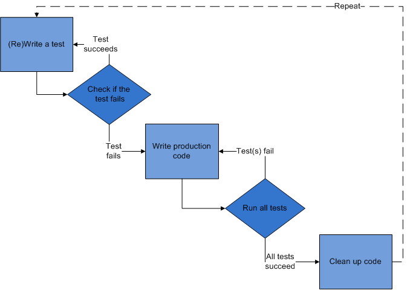

#Test-driven Development (TDD)

##What is TDD?
TDD is a software development process that relies on the repetition of a very short development cycle: first the developer writes an (initially failing) automated test case that defines a desired improvement or new function, then produces the minimum amount of code to pass that test, and finally refactors the new code to acceptable standards.
Test-driven development is related to the test-first programming concepts of extreme programming, begun in 1999, but more recently has created more general interest in its own right.
TDD can be described with a simple formula:

```sh
TDD = Refactoring + TFD (test first development).
```

The following sequence is based on the book Test-Driven Development by Example.


